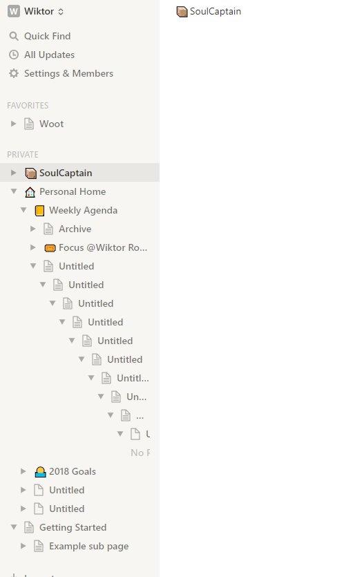
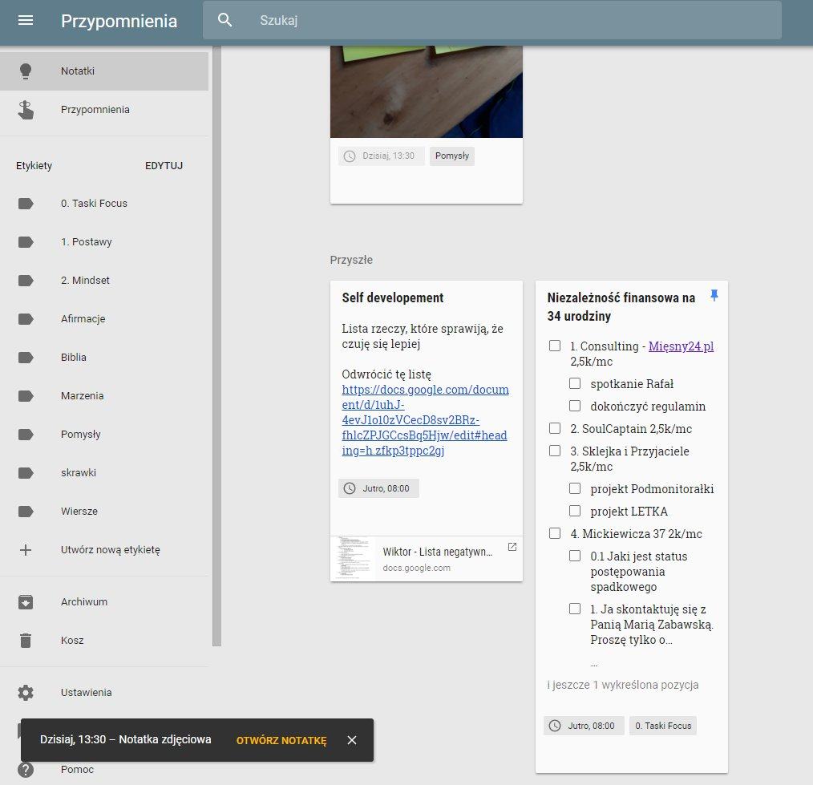
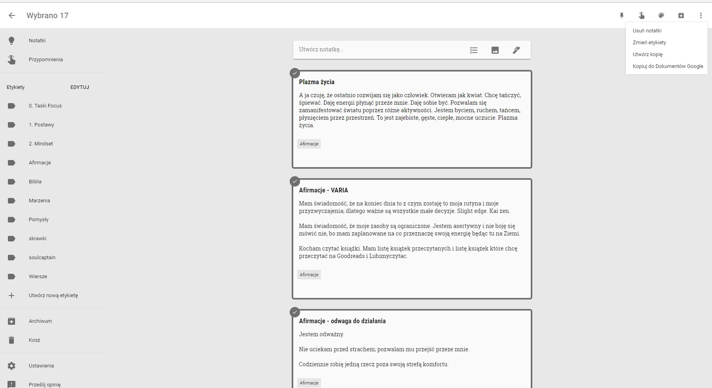
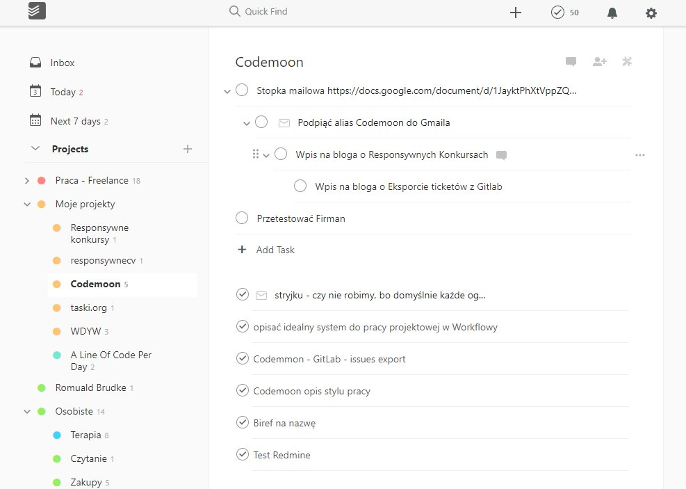

# SoulCaptain

[User Stories](https://www.notion.so/e05ca398f766481ca734920d9b6c4c62)

- [ ]  przenieść tu [https://gitlab.com/maciejjankowski/soulcaptain/wikis/ideas](https://gitlab.com/maciejjankowski/soulcaptain/wikis/ideas) Today
- [ ]  w local storage trzymać info o tym czy menu jest otwarte czy zamknięte

# Ficzery

1. Móc robić w lewym menu dowolną ilość zagłębień
  1. 

    

2. Markdown support
  1. Podczas pisania na żywo można używać tagów markdown
  2. Potrafi wyeksportować dowolny deck do
    1. Markdown
    2. HTML
3. Ficzery które chcemy z 
4. Umie z bulletów zrobić tabelę
  1. Nagłówki to nazwy bulletów na 1 poziomie
5. Karta może mieć dodatkowe właściwości jak
  1. Assaignee
  2. Due date
6.  Umie soulencje z dzisiejszą datą wyświetlić w widoku "Focus"
7. Soulencje
  1. Każda liniia w dokumencie to Soulencja
  2. Mogą być komentowane
    1. Po kliknięciu dokument pomiędzy wierszami rozjeżdża się tak jak by się robiło Code Review na Github
  3. Moga być przesuwane góra dół w ramach kart (drag and drop jak w OneNote)
  4. Mogą być wcinane tabem
  5. Mogą być tagowane
  6. Mogą należeć do wielu kart jednocześnie (jako linki)
  7. Mogą być forkowane/klonowane
  8. Mogą być embedowane poprzez @ - trzeba podać ich ID lub zacząć wpisywać ich treść, wtedy dana soulencja będzie wyświatlana jako "Iframe"
  9. :: po lewej mają opcję
    1. Send to Top
    2. Send to Bottom
    3. Sent do line _____
  10. Soulencja może być opakowana w kartę
  11. Każda soulencja w danym widoku (karcie/dokumencie) ma swój numer
    1. tak samo jak w edytorze do kodu np. Visual Studio Code
8. Karty
  1. Kartę tworzymy wcinając 1 poziom soulencję pod drugą
  2. Wtedy soulencja wyżej automatycznie staje się tytułem tej karty
9. Deck
  1. Widok siatki kart
    1. Można przeglądać karty jak FB / 9gag używajć J K
  2. Widok dokumentu
    1. Nie widać przerw pomiędzy kartami
10. Tagi
  1. Znaczniki służące do robienia prostych kwerend Last Friday
  2. Jeśli wejdę sobie na jakiś tag, np. #Afirmacje, to w ramach niego mogę sobie drag and drop poustawiać kolejność elementów w ramach tagów
  3. Umie wyfiltrować tagi jak #afirmacje, #cytaty
  4. Umie wyfiltorwać wszystkie soulencje z datą jak Last Friday Tuesday 3pm Last Saturday tak ładnie jak Google Keep

    

  5. Można sobie elegancko wyeksporotować dany tag lub kwerendę do markdown/HTML lub po prostu opublikować kwerendę jako oddzielną stronę

    

11. Ma super skróty klawiszowe
  1. [https://www.notion.so/Keyboard-and-markdown-shortcuts-66e28cec810548c3a4061513126766b0](https://www.notion.so/Keyboard-and-markdown-shortcuts-66e28cec810548c3a4061513126766b0)
12. Drag and drop bulletów zagnieżdżonych soulcencji tak jak w notion.so
13. Drag and drop soulencji ze zdjęciami tak jak w [notion.so](http://notion.so) ←pokazuje gdzie dropnie ładnym niebieskim podreśleniem soulencji w treści dokumentu
14. Widok decku fullscreen/focus to de facto jak Power Point.
  1. Możesz sobie do czachy wybijać słówka
  2. Możesz w ten sposób prezentować innym dokument
15. Wyszukiwanie pełnotekstowe
  1. Do poziomy pojedynczej soulencji
16. Kwerendy
  1. np.
    1. pokaż mi rzeczy do zrobienia na dziś które są taskami []
      1. pokaż mi rzeczy do zrobienia na dziś które są taskami [] i które należą do SoulCaptain lub SklejkaiPrzyjaciele
17. Skrzynka wrzutowa zgodna z GTD
  1. Jeśli dodaję na szybko jakąś notatkę, to trafia ona do difoltowego folderu/skrzynki wrzytowej, gdzie potem można sobie taką notatkę przeciągnąć do odpowiedniego folderu projektowego
  2. tak jak w todoist

    

18. Link do decku w decku umie zamienić w tekst
  1. czyli przenieść soulencje z decka do dekca
19. Pokazuj/nie pokazuj ukończone taski
  1. pokaż inline ukończone (onenote, notion.so)
  2. pokaż podspodem (google keep, todoist)

    

20. task dla @Wiktor Roktiw
21. Wersjonowanie
  1. Wersjonowanie np. Gitem
  2. Żeby było łatwiej to na początek wersjonowanie samych soulencji
  3. Możliwość powrotu do poprzedniej wersji
  4. Możliwość narysowania "drzewa życia" Soulencji: kto kiedy i gdzie sforkował lub zrobił symlink
22. Import i export
  1. Markdown